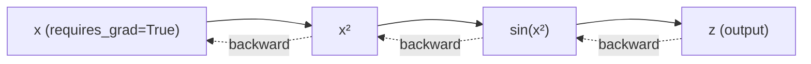

# 01 — Foundations: Tensors & Autograd


**The two primitives every PyTorch project is built on**: the `Tensor` (data + shape + dtype) and `autograd` (the engine that computes gradients through any chain of operations on tensors). This folder is the from-scratch groundwork for the `deep-learning` repo — everything after this (layers, losses, optimizers, training loops) is built on top of these two ideas.

---

## 📦 What's Inside

| Notebook | Covers | Core Question It Answers |
|---|---|---|
| [`01_tensors.ipynb`](./01_tensors.ipynb) | Creation, shapes/dtypes, math ops, linear algebra, reshaping, in-place ops, NumPy interop | "How do I represent and manipulate numerical data efficiently?" |
| [`02_autograd.ipynb`](./02_autograd.ipynb) | Scalar/vector gradients, chain rule, manual-vs-autograd derivation on a binary classifier | "How does PyTorch compute `dL/dw` without me deriving it by hand?" |

---

## 🚀 Quickstart (60 seconds)

```bash
git clone https://github.com/hamidrazabajwa49/deep-learning.git
cd deep-learning/01_foundations

python -m venv venv && source venv/bin/activate   # optional but recommended
pip install torch numpy jupyter

jupyter notebook
```

Open `01_tensors.ipynb` first, then `02_autograd.ipynb` — autograd assumes tensor fluency.

---

## 🧠 Concepts & Intuition

### 1. Tensors — "NumPy arrays that know how to run on a GPU and track gradients"

**Core intuition:** A tensor is just an n-dimensional array plus two extra pieces of metadata: a **device** (CPU/GPU) and, optionally, a **gradient tape**. Every other PyTorch object (a model's weights, an image batch, a loss value) is a tensor underneath.

| Subtopic | What it means | Where it shows up in the notebook |
|---|---|---|
| **Creation** | Different ways to instantiate a tensor: uninitialized (`empty`), filled (`zeros`/`ones`/`full`), random (`rand`), ranged (`arange`, `linspace`), identity (`eye`) | Section: *Tensor Creation* |
| **Shapes & dtypes** | `.shape` tells you the geometry, `.dtype` tells you the precision (int64, float32, ...). Mismatched dtypes are the #1 source of silent bugs in ML code | Section: *Shapes & dtypes* |
| **Math ops** | Scalar ops (`x + 2`) broadcast a single number across the whole tensor; element-wise ops (`t1 * t2`) apply position-by-position; reductions (`sum`, `mean`, `max`) collapse a dimension into a statistic | Sections: *Mathematical Operations*, *Reduction* |
| **Linear algebra** | `matmul` is the operation every neural network layer is built from (`output = matmul(input, weights)`); `dot`, `det`, `inverse` are the building blocks for classical ML and optimization theory | Section: *Linear algebra* |
| **Algebraic / activation functions** | `sigmoid`, `softmax`, `relu` — the nonlinearities that let networks model non-linear relationships. Without them, stacking layers would collapse into one linear layer | Section: *Algebraic Functions* |
| **Reshaping** | `reshape`/`flatten`/`permute` change how data is *viewed*, not the data itself. `unsqueeze`/`squeeze` add/remove size-1 dimensions — critical for batching | Section: *Reshaping* |
| **In-place ops** | Methods ending in `_` (e.g. `add_`, `relu_`) mutate the tensor directly instead of allocating a new one — saves memory but destroys the original value, so use carefully around autograd | Section: *In-place Operations* |
| **NumPy interop** | `torch.from_numpy()` / `.numpy()` share the same memory buffer — zero-copy conversion, which is why PyTorch plays well with the rest of the Python data-science stack | Section: *NumPy Interop* |

> **Confidence: 95%** — these are stable, well-documented PyTorch APIs; behavior described matches current PyTorch semantics.

---

### 2. Autograd — "A calculator that remembers every step you took, so it can walk backward and apply the chain rule automatically"

**Core intuition:** Every time you do an operation on a tensor with `requires_grad=True`, PyTorch silently builds a **computational graph** (a DAG of operations). Calling `.backward()` walks that graph in reverse, applying the chain rule at each node. `x.grad` is the accumulated result — no manual calculus required.



| Subtopic | What it means | Where it shows up in the notebook |
|---|---|---|
| **Scalar gradients** | `y = x**2; y.backward()` fills `x.grad` with `dy/dx` evaluated at the current value of `x`. This is the simplest possible case: one input, one output | Section: *Scalar Gradients* |
| **Chain rule in practice** | `z = sin(x**2)` requires the chain rule (`dz/dx = 2x·cos(x²)`) — autograd computes this automatically by composing the local derivative of `sin` with the local derivative of `x**2` | Section: *Scalar Gradients* (second cell) |
| **Manual vs. Autograd** | The notebook derives gradients for a binary classifier (`sigmoid` + binary cross-entropy) **by hand** first, then reproduces the identical numbers using `.backward()`. This is the single best exercise for building trust in autograd — you *see* it's not magic, it's just the chain rule applied mechanically | Section: *Manual vs Autograd Gradients* |
| **Vector gradients** | `y = (x**2).mean(); y.backward()` — when the output isn't a scalar, PyTorch needs a scalar to backpropagate from (here, `.mean()` provides it). `x.grad` becomes a full vector, one partial derivative per input element | Section: *Vector Gradients* |

**Why the manual-vs-autograd comparison matters:** it's the fastest way to build the intuition that `loss.backward()` isn't a black box — it's doing exactly the calculus you'd do on paper, just faster and for graphs far too large to differentiate by hand (millions of parameters in a real network).

> **Confidence: 90%** — the mechanics described (computational graph, reverse-mode AD, chain rule composition) are accurate to PyTorch's implementation. The exact internal graph representation (autograd `Function` nodes) is simplified here for intuition rather than described at implementation depth.

---

## 🗂️ Repository Structure

```
deep-learning/
└── 01_foundations/
    ├── 01_tensors.ipynb      # Tensor creation, ops, reshaping, NumPy interop
    ├── 02_autograd.ipynb     # Reverse-mode AD, chain rule, manual vs autograd
    └── README.md              # You are here
```

---

## 📊 Key Takeaways

| Idea | One-line summary |
|---|---|
| Tensors | n-dimensional arrays + device + optional gradient tracking |
| Broadcasting | Scalar/shape-mismatched ops expand automatically along compatible dimensions |
| `matmul` | The single operation underlying every dense/linear layer |
| Autograd | Builds a graph on the forward pass, applies chain rule on `.backward()` |
| `requires_grad=True` | Opts a tensor into gradient tracking — leaf tensors accumulate `.grad` |
| In-place ops (`_` suffix) | Faster/leaner but can break the autograd graph if misused |

---

## 🤝 Contribution & License

This is a personal learning repository built as part of a 60-day from-scratch ML/DL build challenge. Suggestions and corrections are welcome via issues or PRs.

Licensed under the [MIT License](../LICENSE).
