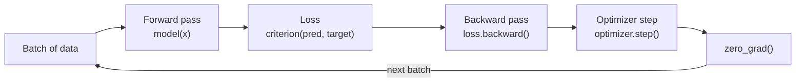

# 02 — Core Components: Modules, Data Pipelines & Training Loops


**The three building blocks that turn tensors + autograd (from `01_foundations`) into a trainable model**: `nn.Module` (how a network is *defined*), `Dataset`/`DataLoader` (how data is *fed in*), and the training loop (how the model *learns*). This folder assembles all three into one working end-to-end classifier.

---

## 📦 What's Inside

| Notebook | Covers | Core Question It Answers |
|---|---|---|
| [`03_nn_module.ipynb`](./03_nn_module.ipynb) | Three patterns for defining models with `nn.Module`: single layer, explicit multi-layer, `nn.Sequential` | "How do I define a model's architecture in PyTorch?" |
| [`04_dataset_dataloader.ipynb`](./04_dataset_dataloader.ipynb) | Custom `Dataset` class, `DataLoader` batching/shuffling, train/test splitting | "How do I get raw data into a model, efficiently and in batches?" |
| [`05_training_pipeline.ipynb`](./05_training_pipeline.ipynb) | Full pipeline on the Breast Cancer dataset: preprocessing → model → loop → evaluation | "How do all the pieces fit together into one working system?" |

---

## 🚀 Quickstart (60 seconds)

```bash
git clone https://github.com/hamidrazabajwa49/deep-learning.git
cd deep-learning/02_core_components

python -m venv venv && source venv/bin/activate   # optional but recommended
pip install torch torchinfo numpy pandas scikit-learn jupyter

jupyter notebook
```

Recommended reading order: `03 → 04 → 05`. Notebook 5 reuses the exact `Dataset` pattern from notebook 4 and the `nn.Sequential` pattern from notebook 3 — it's the payoff notebook.

---

## 🧠 Concepts & Intuition

### 1. `nn.Module` — "A container that bundles a model's learnable parameters with its forward computation"

**Core intuition:** Every PyTorch model is a Python class that inherits from `nn.Module`. Inheriting gives you two things for free: (1) automatic tracking of every learnable parameter you assign as an attribute (`nn.Linear`, `nn.Conv2d`, etc. all register their weights automatically), and (2) a callable object — `model(x)` secretly calls `model.forward(x)`. You never call `.forward()` directly.

| Subtopic | What it means | Where it shows up in the notebook |
|---|---|---|
| **Pattern 1 — Single layer (logistic regression)** | The minimal `nn.Module`: one `nn.Linear` + `nn.Sigmoid`. Mathematically identical to classical logistic regression — just expressed as a neural net | Section: *Pattern 1* |
| **Pattern 2 — Explicit hidden layer** | Layers are defined individually (`fc1`, `relu`, `fc2`, `sigmoid`) and wired together manually inside `forward()`. Gives full control over data flow — useful when layers need to branch, skip, or reuse | Section: *Pattern 2* |
| **Pattern 3 — `nn.Sequential`** | Same architecture as Pattern 2, but layers are declared in order inside `nn.Sequential`, which auto-generates the `forward()` pass. Less code, but only works for simple linear stacks (no branching) | Section: *Pattern 3* |
| **`torchinfo.summary()`** | Prints a table of every layer, its output shape, and parameter count — the fastest sanity check that your architecture matches what you intended before you waste time training it | All three patterns |

**When to use which pattern:** Sequential for simple feed-forward stacks (fastest to write), explicit `forward()` when you need control flow (skip connections, multiple inputs, conditional branches) — exactly the tradeoff seen going from Pattern 2 to Pattern 3 in the notebook: same architecture, less code.

> **Confidence: 95%** — these are the three standard, well-documented ways to define a PyTorch model; the tradeoffs described match accepted convention in the ecosystem.

---

### 2. `Dataset` & `DataLoader` — "A vending machine for your data: `Dataset` stocks it, `DataLoader` dispenses it in batches"

**Core intuition:** A `Dataset` answers two questions — "how many samples do you have?" (`__len__`) and "give me sample `i`" (`__getitem__`). That's it. It doesn't know anything about batching, shuffling, or parallel loading — that's the `DataLoader`'s job. Separating these two concerns means the same `Dataset` can be reused with any batch size, shuffle setting, or number of worker processes without touching the data logic.

| Subtopic | What it means | Where it shows up in the notebook |
|---|---|---|
| **Custom `Dataset` class** | Subclass `Dataset`, implement `__init__` (store references), `__len__` (return sample count), `__getitem__` (return one `(features, label)` pair by index) | Section: *Custom Dataset Class* |
| **`DataLoader` — batching & shuffling** | Wraps a `Dataset` and yields mini-batches. `shuffle=True` reshuffles sample order every epoch — critical for preventing the model from learning the order of the data instead of the patterns in it | Section: *DataLoader — Batching & Shuffling* |
| **Train/test split via `random_split`** | Splits a `Dataset` object directly (not the raw arrays) into disjoint subsets, each of which still behaves like a full `Dataset` and can be wrapped in its own `DataLoader` | Section: *Train/Test Split with DataLoader* |

**Why this separation matters:** in `05_training_pipeline.ipynb`, the identical `CustomDataset` class from notebook 4 is reused verbatim on a completely different dataset (Breast Cancer instead of synthetic `make_classification` data) — proof the abstraction is doing its job.

> **Confidence: 95%** — this is the canonical `Dataset`/`DataLoader` contract as documented by PyTorch; the batching/shuffling behavior described is exact.

---

### 3. Training Pipeline — "The loop that repeatedly asks: how wrong was I, and which direction reduces that wrongness?"

**Core intuition:** Training a model is one loop, repeated: **forward pass** (make a prediction) → **loss** (measure how wrong it was) → **backward pass** (compute *how* each weight contributed to that wrongness, via autograd from `01_foundations`) → **optimizer step** (nudge each weight slightly in the direction that reduces the loss). Repeat for many epochs and the weights converge toward values that make good predictions.

| Subtopic | What it means | Where it shows up in the notebook |
|---|---|---|
| **Preprocessing** | `StandardScaler` rescales features to mean 0 / std 1 — without this, features on different scales (e.g. cell radius vs. cell area) distort gradient updates. `LabelEncoder` converts string labels (`M`/`B`) to `0`/`1` | Section: *Data* |
| **Model** | `BinaryClassifier` — a single `nn.Linear` + `nn.Sigmoid` wrapped in `nn.Sequential`, reusing Pattern 3 from `03_nn_module.ipynb` | Section: *Model* |
| **Loss function — `nn.BCELoss`** | Binary Cross-Entropy: penalizes confident-and-wrong predictions heavily, confident-and-right predictions barely at all. Pairs with a `Sigmoid` output, which squashes predictions into a valid `(0, 1)` probability range | Section: *Training Loop* |
| **Optimizer — `SGD`** | Stochastic Gradient Descent: after `loss.backward()` populates `.grad` on every parameter, `optimizer.step()` updates each parameter by `param -= lr * param.grad`. `optimizer.zero_grad()` must run every iteration — gradients accumulate by default and must be reset | Section: *Training Loop* |
| **Epoch loop structure** | `model.train()` → iterate `DataLoader` batches → `zero_grad()` → forward → loss → `backward()` → `step()` → accumulate loss for logging. This five-step inner loop is the template for every PyTorch training script you will write | Section: *Training Loop* |
| **Evaluation** | `model.eval()` disables training-only behaviors (dropout, batch-norm updates); `torch.no_grad()` disables gradient tracking since no `.backward()` is needed at inference time, saving memory and compute | Section: *Evaluation* |



**Why `zero_grad()` placement matters:** it must be called before `backward()` each iteration — PyTorch accumulates gradients into `.grad` by default (useful for gradient accumulation across large batches), so forgetting this line silently corrupts training by summing gradients across every batch seen so far.

> **Confidence: 90%** — the training loop mechanics and loss/optimizer behavior are accurate to PyTorch's documented API. Exact numerical convergence (final accuracy, loss curve shape) varies run-to-run due to random initialization and isn't independently re-verified here.

---

## 🗂️ Repository Structure

```
deep-learning/
└── 02_core_components/
    ├── 03_nn_module.ipynb            # Model definition: 3 patterns
    ├── 04_dataset_dataloader.ipynb   # Data pipeline: Dataset + DataLoader
    ├── 05_training_pipeline.ipynb    # End-to-end: Breast Cancer classifier
    └── README.md                      # You are here
```

---

## 📊 Key Takeaways

| Idea | One-line summary |
|---|---|
| `nn.Module` | Base class that auto-registers parameters and makes the model callable |
| `nn.Sequential` | Shorthand for stacking layers with no branching logic |
| `Dataset` | Defines *what* the data is (`__len__`, `__getitem__`) |
| `DataLoader` | Defines *how* the data is served (batching, shuffling, splitting) |
| Training loop | forward → loss → `backward()` → `optimizer.step()` → `zero_grad()`, repeated per batch/epoch |
| `model.train()` / `model.eval()` | Toggles training-only behaviors (dropout, batch-norm) on/off |
| `torch.no_grad()` | Disables gradient tracking during inference to save memory/compute |

---
