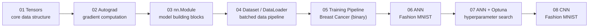

# Deep Learning with PyTorch 🔥


A progressive, from-first-principles PyTorch curriculum — starting at raw tensors and autograd, building up through `nn.Module`, custom `Dataset`/`DataLoader` pipelines, a full training loop, and ending in ANN and CNN image classifiers trained on Fashion MNIST, tuned with Optuna.

---

## 🧠 Why This Exists

- **No black boxes** — every layer of the stack (tensors → autograd → `nn.Module` → training loop) is built and understood before the next abstraction is introduced.
- **One dataset, increasing complexity** — Fashion MNIST is reused across the ANN, Optuna-tuned ANN, and CNN notebooks, so architecture and hyperparameter changes are the only variable, making results directly comparable.
- **GPU-aware and reproducible** — training notebooks detect and use CUDA when available, include LR scheduling, and report per-class precision/recall/F1, not just overall accuracy.
- **Hyperparameter search done properly** — Optuna is used to search the ANN's hyperparameter space rather than hand-tuning, with the best config retrained and re-evaluated from scratch.

---

## 🚀 Quickstart (60 seconds)

```bash
git clone <repo-url>
cd Deep_Learning

python -m venv venv
source venv/bin/activate        # Windows: venv\Scripts\activate

pip install -r requirements.txt
```

Then open any notebook in order — no external setup required beyond placing `fashion_mnist.csv` (see [Data & Model Details](#-data--model-details) below):

```bash
jupyter notebook 01_foundations/01_tensors.ipynb
```

---

## 🏗️ Architecture / Under the Hood

**Tech stack:** PyTorch, torchvision, torchinfo (model summaries), Optuna (HPO), scikit-learn (metrics/splits), pandas, matplotlib.

**Learning pipeline flow:**



Each notebook is self-contained but assumes concepts from the previous stage — treat it as a ladder, not a menu.

---

## 📊 Data & Model Details

### Dataset

| Dataset | Used in | Source | Notes |
|---|---|---|---|
| Fashion MNIST (`fashion_mnist.csv`) | `06`, `07`, `08` | Zalando Research, via Kaggle CSV export | 28×28 grayscale, 10 classes, flattened-pixel CSV format |
| Breast Cancer Wisconsin | `05` | Auto-downloaded via scikit-learn | Binary classification, tabular |

### Models & Results

| Notebook | Model | Key Config | Accuracy | Notes |
|---|---|---|---|---|
| `06_ann_fashion_mnist` | Fully-connected ANN | GPU support, LR scheduler | *fill from executed output* | Baseline ANN, per-class report included |
| `07_ann_optuna` | ANN (Optuna-tuned) | Search over layers/units/LR/dropout | *fill from executed output* | Best trial retrained fresh |
| `08_cnn_fashion_mnist` | CNN, 2 conv blocks | Conv → Pool ×2 → FC head | *fill from executed output* | Per-class precision/recall/F1 reported |

> Metrics intentionally left blank — pull them straight from the last executed cell of each notebook, never estimate.

---

## 📁 Repository Structure

```
Deep_Learning/
├── 01_foundations/
│   ├── 01_tensors.ipynb              # Tensor creation, ops, NumPy interop
│   └── 02_autograd.ipynb             # Automatic differentiation, manual vs autograd gradients
│
├── 02_core_components/
│   ├── 03_nn_module.ipynb            # nn.Module patterns (logistic, hidden layers, Sequential)
│   ├── 04_dataset_dataloader.ipynb   # Custom Dataset & DataLoader with batching
│   └── 05_training_pipeline.ipynb    # Full binary classification pipeline (Breast Cancer)
│
├── 03_ann/
│   ├── data/
│   │   └── fashion_mnist.csv         # Local copy used by notebooks in this folder
│   ├── 06_ann_fashion_mnist.ipynb    # ANN on Fashion MNIST, GPU support, LR scheduler, per-class report
│   └── 07_ann_optuna.ipynb           # Hyperparameter search with Optuna, retrain best config
│
└── 04_cnn/
    ├── data/
    │   └── fashion_mnist.csv         # Local copy used by notebook in this folder
    └── 08_cnn_fashion_mnist.ipynb    # CNN on Fashion MNIST, two conv blocks, per-class report
```

---

## 📦 Requirements

```
torch
torchvision
torchinfo
optuna
scikit-learn
pandas
matplotlib
```

```bash
pip install torch torchvision torchinfo optuna scikit-learn pandas matplotlib
```

---

## 📈 Progression

| Step | Notebook | What it teaches |
|---|---|---|
| 1 | Tensors | The core data structure everything else is built on |
| 2 | Autograd | How gradients are actually computed |
| 3 | `nn.Module` | Building models with PyTorch's module system |
| 4 | Dataset / DataLoader | Efficient, batched data pipelines |
| 5 | Training Pipeline | The end-to-end training loop pattern |
| 6 | ANN — Fashion MNIST | Applying the full stack to a real image dataset |
| 7 | Optuna | Automating hyperparameter search instead of guessing |
| 8 | CNN — Fashion MNIST | Adding spatial feature extraction (conv layers) |

---

## 🤝 Contribution & License

This is a personal learning repository — issues and suggestions are welcome via PRs. 
